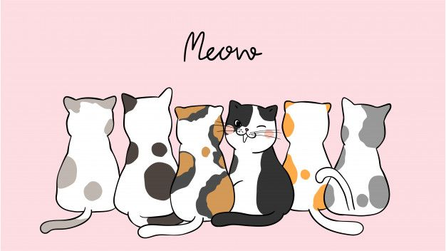

# Cats Classifier



## Table of contents

- [Summary](#summary)
- [Repo Structure](#repo-structure)
- [Dataset](#dataset)
- [Methodology](#methodology)
- [How to use the app ?](#how-to-use-the-app)
- [Technologies](#technologies)
- [Bibliography](#bibliography)

## Summary

Deep learning algorithms are widely used in various fields, such as computer vision. Computer vision allows the computer to "see" and do things like identify specific objects in an image, or classify images according to their content.
This project is about image classification. More specifically, the aim is to identify the breed of a cat in an image. To achieve this classifier, Transfer learning will be performed. Among all existing models, three will be explored: Xception, ResNet50 and EfficientNetB7.

## Repo Structure

```bash
.
|── api
    |── __init__.py
    |── backend.py
    |── frontend.py
    |── image-backend.dockerfile
    |── image-frontend.dockerfile
    |── proto.py
    |── requirements-backend.txt
    |── requirements-frontend.txt
|── illustrations                           # screenshots
|── kube-config
    |── backend-deployment.yaml
    |── backend-service.yaml
    |── deployment.sh
    |── frontend-deployment.yaml
    |── frontend-service.yaml
    |── model-deployment.yaml
    |── model-service.yaml
|── models                                  # models in h5 format
    |── resnet50_30_0.699.h5
|── notebooks                               # notebook
    |── notebook.ipynb
    |── tf-serving.ipynb
|── scripts
    |── __init__.py                              # script to train the model
    |── train.py
|── tests
    |── __init__.py                               # script to test different components
    |── test_backend.py
    |── test_proto.py
|── .gitattributes
|── .gitignore
|── .gitlab-ci.yml
|── .pre-commit-config.yaml
|── docker-build.sh
|── image-model.dockerfile
|── proto.py
|── README.md
└── requirements.txt
```

## Dataset

This dataset used comes from Kaggle website. It is available here : [Cat Breeds Refined Dataset](https://www.kaggle.com/datasets/doctrinek/catbreedsrefined-7k).

## Methodology

*Summary of the different training and tuning*
|Model | Accuracy | Loss | Time for tuning |
|------|----------|------|------|
|Xception | 65.93% | 1.16| 52 min |
|ResNet50 | 69.97% | 0.974 | 59 min |
| EfficientNetB7 | 66.18% | 1.738 | 2h25 |


*Transform h5 to files for tensorflow-serving-api*

- Open iPython in a terminal
```
import tensorflow as tf
from tensorflow import keras

model = keras.models.load_model("models/resnet50_30_0.699.h5")
tf.saved_model.save(model, 'cats-classifier')

```

## How to use the app?

### Launch locally

This video explains how to launch the "Cats Breeds Classifier" application on your computer.
[](https://youtu.be/Sx3DQ0obns8)

1) Launch Docker Container with tensorflow/serving
```
docker run -it --rm \
  -p 8500:8500 \
  -v $(pwd)/cats-classifier:/models/cats-classifier/1 \
  -e MODEL_NAME="cats-classifier" \
  tensorflow/serving:2.7.0
```

2) Launch backend `uvicorn backend:app`. You can submit pictures by using SwaggerUI available on `localhost:8000/docs`
3) Launch frontend `streamlit run frontend.py`

These two steps needs to be realised in a virtual environment. The virtual environment uses here is *venv*. Here's an explaination to install it in Linux (Debian/Ubuntu).
```
apt install python3.11-venv

# go to the folder if not the case
python3 -m venv <name-of-venv>

source <name-of-env>/bin/activate
pip install -r requirements.txt
```

### Launch locally on Kubernetes

1) Build the three Docker images with the files : *image-model.dockerfile*, *image-backend.dockerfile*, *image-frontend.dockerfile*. You can use *docker-build.sh* by doing `./docker-build.sh` to build the Docker images. If not working, change the permission on the script `chmod +x docker-build.sh`.

2) Create a Kubernetes Cluster :
- with **Kind**: `kind create cluster`
- with **Minikube**: `minikube start --cpus N` (with N the number of CPUs).

3) Load the three images in the cluster:
- with **Kind**: `kind load docker-image <name-of-the-docker-image>:<tag>`.
- with **Minikube**: `minikube image load <name-of-the-docker-image>:<tag>`

4) Apply all the deployment and service in the kube-config folder : `kubectl apply -f <kube-manifest>.yaml`

5) Port forward the three pods : `kubectl port-forward service/<service-name> <port>:<port>`

For steps 2-4, you can use the bash script *deployment.sh* by doing `./deployment.sh`. If not working, change the permission on the script `chmod +x deployment.sh`.

## Technologies

- To create Computer Vision models:
    - [Python 3](https://www.python.org/)
    - [Tensorflow](https://www.tensorflow.org/?hl=fr)
    - [Keras](https://keras.io/)
    - [Google Colab](https://colab.google/)

- To create the application:
    - [FastAPI](https://fastapi.tiangolo.com/)
    - [Streamlit](https://streamlit.io/)

- To deploy the application and the model:
    - [Docker](https://www.docker.com/)
    - [Kubernetes](https://kubernetes.io/)
    - [Kind](https://kind.sigs.k8s.io/) & [Minikube](https://minikube.sigs.k8s.io/docs/start/) -> To test locally in a Kubernetes Cluster


## Bibliography

**General**:
- [Introduction to Dropout for Regularization](https://machinelearningmastery.com/dropout-for-regularizing-deep-neural-networks/)
- [How Do Convolutional Layers Work?](https://machinelearningmastery.com/convolutional-layers-for-deep-learning-neural-networks/)

**Optimizer and Loss Functions for multiclasses classification:**

- [Adam Optimizer for multiclasses classification](https://towardsdatascience.com/multiclass-classification-neural-network-using-adam-optimizer-fb9a4d2f73f4)
- [Understanding Loss functions for classification](https://medium.com/mlearning-ai/understanding-loss-functions-for-classification-81c19ee72c2a)

**Transfer Learning**:
- [Xception: Deep Learning with Depthwise Separable Convolutions](https://arxiv.org/abs/1610.02357)
- [Deep Residual Learning for Image Recognition](https://arxiv.org/abs/1512.03385)
- [EfficientNet: Rethinking Model Scaling for Convolutional Neural Networks](https://arxiv.org/abs/1905.11946)

**Keras Tuner:**
- [Introduction to Keras Tuner](https://www.tensorflow.org/tutorials/keras/keras_tuner?hl=en)
