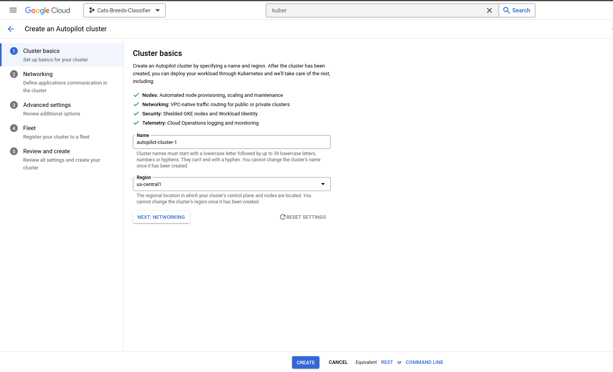

# Cats Classifier


[](https://gitlab.com/cecilegltslmcs/cats-classification/-/commits/main)
[](https://gitlab.com/cecilegltslmcs/cats-classification/-/commits/main)

*Last Update: 21th January 2024*

## Table of contents

- [Summary](#summary)
- [Repo Structure](#repo-structure)
- [Dataset](#dataset)
- [Methodology](#methodology)
- [Prerequisites for deployment](#deployment-prerequisites)
- [How to use the app?](#how-to-use-the-app)
  - [Launch locally](#launch-locally)
  - [Deploy locally with  Kubernetes](#deploy-locally-on-kubernetes)
  - [Deploy on Cloud Provider](#deploy-on-cloud-provider)
- [Technologies](#technologies)
- [Bibliography](#bibliography)

## Summary

Deep learning algorithms are widely used in various fields, such as computer vision. Computer vision allows the computer to "see" and do things like identify specific objects in an image, or classify images according to their content.
This project is about image classification. More specifically, the aim is to identify the breed of a cat in an image. To achieve this classifier, transfer learning will be used. Among all existing architectures, three will be explored: Xception, ResNet50 and EfficientNetB7.

## Repo Structure

```bash
.
|── api                                   # components to serve the model
    |── __init__.py
    |── backend.py
    |── frontend.py
    |── image-backend.dockerfile
    |── image-frontend.dockerfile
    |── proto.py
    |── requirements-backend.txt
    |── requirements-frontend.txt
|── cats-classifier                       # files to serve model with tensorflow-serving-api
|── illustrations
|── kube-config-local                     # Kubernetes manifests to deploy locally
    |── backend-deployment.yaml
    |── backend-service.yaml
    |── frontend-deployment.yaml
    |── frontend-service.yaml
    |── model-deployment.yaml
    |── model-service.yaml
|── kube-config                           # Kubernetes manifests to deploy on GCP/cloud provider
    |── backend-deployment.yaml
    |── backend-service.yaml
    |── frontend-deployment.yaml
    |── frontend-service.yaml
    |── model-deployment.yaml
    |── model-service.yaml
|── model                                 # model in h5 format
    |── resnet50_30_0.699.h5
|── notebooks                             # notebooks
    |── notebook.ipynb
    |── tf-serving.ipynb
|── scripts                               # scripts to automate Docker build & Kubernetes deployment
    |── build_images_local.sh
    |── build_images.sh
    |── deploy.sh
    |── kube_deployment.sh
|── scripts_py                            # script to train the model
    |── __init__.py
    |── train.py
|── tests                                 # unit tests for different components
    |── __init__.py
    |── test_backend.py
    |── test_frontend.py
    |── test_proto.py
|── .gitattributes
|── .gitignore
|── .gitlab-ci.yml
|── .pre-commit-config.yaml
|── image-model.dockerfile
|── proto.py
|── README.md
└── requirements.txt
```

## Dataset

This dataset used comes from Kaggle website. It is available here : [Cat Breeds Refined Dataset](https://www.kaggle.com/datasets/doctrinek/catbreedsrefined-7k).
- To import the dataset in a notebook: `!kaggle datasets download -d doctrinek/catbreedsrefined-7k`

This dataset is made up  of 7,000 cat images, divided into 20 breeds. Each breed contains 350 pictures. This limitation on the number of breeds may represent a limit to our project. The breeds in this dataset are as follows: Abyssinian, American Bobtail, American Curl, American Shorthair, Bengal, Birman, Bombay, British Shorthair, Egyptian Mau, Exotic Shorthair, Maine Coon, Manx, Norwegian Forest, Persian, Ragdoll, Russian Blue, Scottish Fold, Siamese, Sphynx and Turkish Angora. For example, one of the most common cats is Domestic Shorthair but it is not included in our data set.

## Methodology

In this project, different architectures are compared in order to select the most efficient. The selected architectures are: Xception, ResNet50 and EfficientNetB7.
For each architecture, Keras Tuner was used to select the best hyperparameters for each architecture. The distribution of the different classes are balanced. The metric used to evaluate our different architecture is accuracy. Accuracy, loss and time for tuning are measured in order to choice the best architecture. The results are shown in the table below.

|Model | Accuracy | Loss | Time for tuning |
|------|----------|------|------|
|Xception | 65.93% | 1.16 | 52 min |
|ResNet50 | 69.97% | 0.974 | 59 min |
|EfficientNetB7 | 66.18% | 1.738 | 2h25 |

*Table 1: Summary of the performance for each CNN architecture*

Based on these results, the best architecture for our particular dataset is ResNet50. A new model training is performed and checkpointing is used to extract the model with the best accuracy in an h5 format.

## Deployment prerequisites

- **Software requirements:**
  - Docker
  - Kubectl
  - A local cluster such as *Kind* or *Minikube*

- **Model transformation for serving**

For deployment, we need to transform the h5 files in a folder with different component ready to use by tensorflow serving API. The contents of this folder is going to be import in a Docker container.

1. Open iPython in a terminal

2. Type the following commands:
```python
import tensorflow as tf
from tensorflow import keras

model = keras.models.load_model("model/resnet50_30_0.699.h5")
tf.saved_model.save(model, 'cats-classifier')

```

## How to use the app?

### Launch locally

1) Launch Docker Container with tensorflow/serving

```bash
docker run -it --rm \
  -p 8500:8500 \
  -v $(pwd)/cats-classifier:/models/cats-classifier/1 \
  -e MODEL_NAME="cats-classifier" \
  tensorflow/serving:2.14.1
```

2) Launch backend `uvicorn backend:app`. You can submit pictures by using SwaggerUI available on `localhost:8000/docs`.

3) Launch frontend `streamlit run frontend.py`.

These two steps needs to be realised in a virtual environment. The virtual environment uses here is [venv](https://docs.python.org/3/library/venv.html). Here's a short explaination to install it in Linux (Debian/Ubuntu).

```bash
apt install python3.xx-venv # replace xx by our Python version

# go to the folder if not the case
python3 -m venv <name-of-your-venv>

source <name-of-your-venv>/bin/activate
pip install -r requirements.txt
```

### Deploy locally with  Kubernetes

1) Build the three Docker images with the files : *image-model.dockerfile*, *image-backend.dockerfile*, *image-frontend.dockerfile*.
You can use *build_images_local.sh* in the folder *scripts* by doing `./build_images_local.sh` to build the Docker images. If not working, change the permission on the script `chmod +x build_images_local.sh`.

2) Create a Kubernetes cluster:

  - with **Kind**: `kind create cluster`
  - with **Minikube**: `minikube start --cpus N` (with N the number of CPUs; by default in the script N=4).

3) Load the three images in the cluster:

  - with **Kind**: `kind load docker-image <name-of-the-docker-image>:<tag>`.
  - with **Minikube**: `minikube image load <name-of-the-docker-image>:<tag>`

4) Apply all the deployment and service in the kube-config folder: `kubectl apply -f <kube-manifest>.yaml`

5) Port forward the pod containing the frontend image: `kubectl port-forward service/<service-name> <port>:<port>`

For steps 2-4, you can use the bash script *kube_deployment.sh* in the folder *scripts* by doing `./kube_deployment.sh`. If not working, change the permission on the script `chmod +x kube_deployment.sh`.


### Deploy on Cloud Provider

The chosen cloud provider here is Google Cloud Platform (GCP).

1) Create an Artifact Registry in GCP. This artifact registry will received the Docker Images of our project.


2) Create a Kubernetes Cluster with Google Kubernetes Engine.


3) Once the different component created on GCP, you can load Docker images in Artifact Registry. To perform that, a bash script can be found in *scripts* with the name *build_images.sh*.

4) When Docker Images are pulled in Artifact Registry, you can connect to Kubernetes Cluster by using the `gcloud` command give by the platform. After executing this command, you can use the script *deploy.sh* in the folder *scripts*.


5) Execute the command `kubectl port-forward svc/frontend 8501:8501` and launch a browser to the address `localhost:8501` to access to your application.


## Technologies

- To create Computer Vision models:
  - [Python 3](https://www.python.org/)
  - [Tensorflow](https://www.tensorflow.org/?hl=fr)
  - [Keras](https://keras.io/)
  - [Google Colab](https://colab.google/)

- To serve the model and create application:
  - [FastAPI](https://fastapi.tiangolo.com/)
  - [Streamlit](https://streamlit.io/)

- To containerize the application and the model:
  - [Docker](https://www.docker.com/)
  - [Kubernetes](https://kubernetes.io/)
  - [Kind](https://kind.sigs.k8s.io/) & [Minikube](https://minikube.sigs.k8s.io/docs/start/) -> To create a local cluster
  - [Google Kubernetes Engine](https://cloud.google.com/kubernetes-engine)
  - [Artifact Registry](https://cloud.google.com/artifact-registry?hl=fr)

- To automate deployment and test code:
  - [GitLab-CI](https://docs.gitlab.com/ee/ci/) + [Pipeline components](https://gitlab.com/pipeline-components?page=1)
  - [Unittest](https://docs.python.org/3/library/unittest.html)
  - [Terraform](https://www.terraform.io/) [In another branch]

## Bibliography

**General**:

- [Introduction to Dropout for Regularization](https://machinelearningmastery.com/dropout-for-regularizing-deep-neural-networks/)
- [How Do Convolutional Layers Work?](https://machinelearningmastery.com/convolutional-layers-for-deep-learning-neural-networks/)

**Optimizer and Loss Functions for multiclasses classification**:

- [Adam Optimizer for multiclasses classification](https://towardsdatascience.com/multiclass-classification-neural-network-using-adam-optimizer-fb9a4d2f73f4)
- [Understanding Loss functions for classification](https://medium.com/mlearning-ai/understanding-loss-functions-for-classification-81c19ee72c2a)

**Transfer Learning**:

- [Xception: Deep Learning with Depthwise Separable Convolutions](https://arxiv.org/abs/1610.02357)
- [Deep Residual Learning for Image Recognition](https://arxiv.org/abs/1512.03385)
- [EfficientNet: Rethinking Model Scaling for Convolutional Neural Networks](https://arxiv.org/abs/1905.11946)

**Keras Tuner**:

- [Introduction to Keras Tuner](https://www.tensorflow.org/tutorials/keras/keras_tuner?hl=en)


[DEPRECATED: This part was finally removed and place in another git branch]

**Deployment Automation**:
- [Provisioning Kubernetes clusters on GCP with Terraform and GKE](https://learnk8s.io/terraform-gke)
- [Gitlab CI/CD to deploy applications on GKE](https://medium.com/@jaydeepawar4912/gitlab-ci-cd-to-deploy-applications-on-gke-806658160534)
